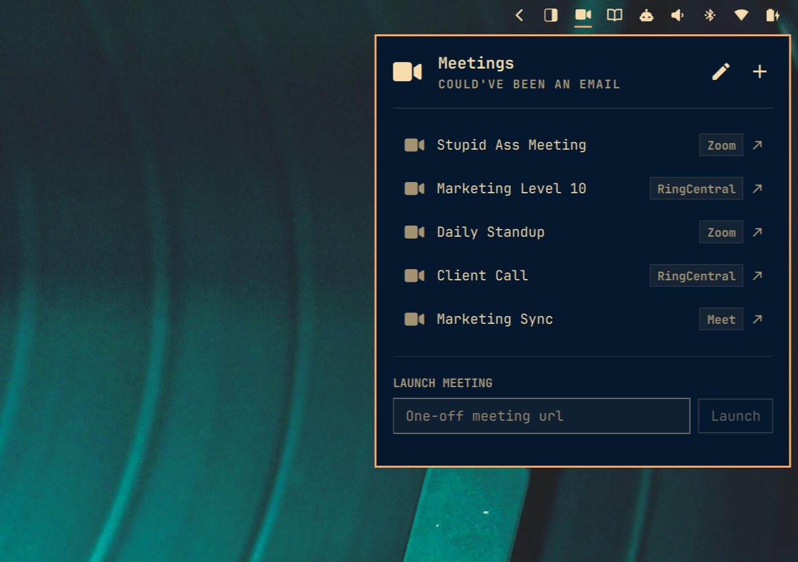

# Omarchy Meetings



A meeting-link launcher for the [Omarchy](https://omarchy.org) shell bar. It's a
glorified bookmark manager for meeting URLs — Zoom, Google Meet, RingCentral,
Microsoft Teams, Webex, Whereby, Jitsi, or anything else with an `https://` link —
with one catch that makes it worth having:

**Every link opens as an Omarchy web app** (`chromium --app`), which means the
meeting lands in a normal **tiled Hyprland pane** that slots right into your
existing layout. No browser chrome, no floating window, no hunting for the tab.

## Features

- 󰕧 bar icon with a popup panel listing your meeting links
- Add links inline (name + URL) or hand-edit the JSON
- Hover a row for its pencil and ✕: edit the name and URL in place (the row
  swaps to inline fields) or remove the link
- "Launch meeting" field at the bottom: paste any URL (scheme optional) and
  launch it as a one-off tiled web app without saving it
- Provider chips auto-detected from the URL (Zoom, Meet, RingCentral, Teams, …)
- Copy button beside every provider chip puts a shareable meeting URL on the clipboard
- Zoom `/j/<id>` links are rewritten to the `app.zoom.us/wc/join` web client, so
  they skip the "Open Zoom app" interstitial and join straight in the browser
- Keyboard driven: `a` add · `e` edit the highlighted row · `j`/`k` or arrows
  to move · `Enter` to join · `Delete` to remove · `Esc` to close
- Config hot-reloads within five seconds when the file changes on disk
- HTTPS-only URL parsing rejects userinfo, control characters, and deceptive provider domains
- Credential-bearing URLs cross the launcher boundary through a private stdin pipe,
  never process arguments

## Requirements

- Omarchy Quattro
- Runtime tools included with Omarchy: `omarchy-launch-webapp`, `wl-copy`, `python3`, and GNU `timeout`
- Omarchy's Chromium web-app setup

There are no additional packages, background services, or elevated setup steps.

## Install

Review the source, then install and enable the widget:

```bash
omarchy plugin add https://github.com/TyRichards/omarchy-meetings-launcher.git --enable
```

Omarchy adds enabled bar widgets to the right section by default. Move it if desired:

```bash
omarchy bar move io.github.tyrichards.meetings --section center
```

## Update

```bash
omarchy plugin update io.github.tyrichards.meetings
```

## Remove

```bash
omarchy plugin remove io.github.tyrichards.meetings
```

Saved links remain in `~/.config/omarchy/meetings.json`. Remove that file separately
if you also want to delete the plugin's data.

## Config

Links live in `~/.config/omarchy/meetings.json`:

```json
{
  "version": 1,
  "meetings": [
    { "name": "Daily Standup", "url": "https://zoom.us/j/123456789?pwd=abc" },
    { "name": "Marketing Sync", "url": "https://meet.google.com/abc-defg-hij" },
    { "name": "Client Call", "url": "https://v.ringcentral.com/join/123456789" }
  ]
}
```

Reorder by rearranging the array. The panel picks up valid edits within five
seconds. The file must contain only `version` and `meetings`; it is capped at
64 KiB and 100 entries. Names are capped at 120 characters and canonical HTTPS
URLs at 4,096 characters. Invalid files are rejected rather than partially
loaded.

Meetings creates and maintains this file as an owner-only regular file (`0600`).
Symlinks, special files, files owned by another user, and oversized files are
rejected before their contents enter the shell. Writes use a private temporary
file followed by an atomic replacement, preserving the prior file if saving
fails.

### Settings

Inline settings on the bar entry in `shell.json`:

| Setting | Default | Purpose |
|---|---|---|
| `zoomWebClient` | `true` | Rewrite Zoom `/j/<id>` links to the browser web client |

```json
{ "id": "io.github.tyrichards.meetings", "zoomWebClient": false }
```

## Why the windows tile

Omarchy launches web apps through `omarchy-launch-webapp`, and its default
Hyprland rules tag Chromium-based windows with `tile = true` — so meeting
windows behave like any other pane: tile, split, move to a workspace, fullscreen.

## Security and data access

Like every Omarchy plugin, Meetings runs unsandboxed inside `omarchy-shell` with
your user permissions. It reads `~/.config/omarchy/meetings.json` and writes that
file only when you explicitly add, edit, reorder, or remove a saved link. Saved
meeting URLs can contain reusable passwords or access tokens in their query
strings, so the plugin keeps the file owner-only and you should still treat it
as sensitive.

Opening a meeting sends the canonical HTTPS URL over a private stdin pipe to
the fixed `bin/meetings-launch` helper. The helper rechecks the URL, writes an
owner-only (`0600`) redirect document inside a private (`0700`) runtime
directory, and gives `omarchy-launch-webapp` only that non-secret file URL. The
redirect is deleted as soon as Chromium opens it (or after a short deadline), so
meeting tokens are never copied into process arguments, logs, or environment
variables. Copying a link likewise sends it to a fixed `wl-copy --` process over
stdin. Bounded configuration reads and atomic writes run through the bundled
`bin/meetings-config` helper using `python3` under a `timeout` deadline. The
plugin requests no elevated permissions,
installs no packages, starts no background service, and collects no analytics.

## Validate from source

```bash
omarchy plugin validate .
node tests/model.test.js
python3 -m unittest -v tests/config_helper_test.py tests/launch_helper_test.py
```

## License

MIT
